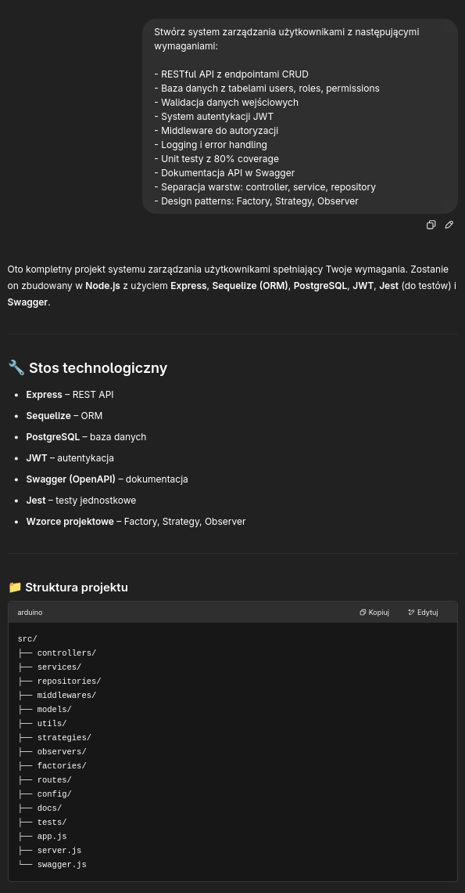
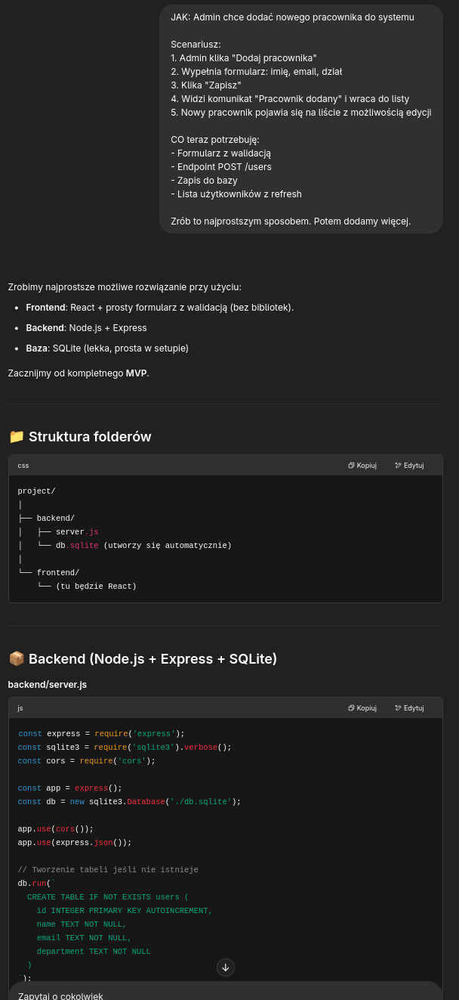

# JAKCO - TDD w vibe praktyce


## #JAKCO a nie #COJAK - rewolucja w podejściu do developmentu

**Better done than perfect** - to motto, które napędza nową metodę programowania zwaną JAKCO. To podejście, które stawia user experience na pierwszym miejscu i buduje aplikacje incrementalnie, warstwa po warstwie.

### Co to jest JAKCO?

**JAKCO** = **JAK** użytkownik → **CO** aplikacja

To metodologia, która odwraca tradycyjne podejście do programowania. Zamiast zaczynać od architektury i wymagań technicznych, zaczynamy od scenariusza użytkownika i budujemy aplikację krok po kroku.

### Dlaczego JAKCO działa?

- **Start od user experience, buduj incrementalnie**
- **JAK CO → JAK CO** - rytmiczne przełączanie między perspektywą użytkownika a implementacją
- **Vibecoder ma działającą funkcję po 2 godzinach**
- **Admin może testować od razu**
- **Feedback jest natychmiastowy**
- **Kolejne funkcje dodawane stopniowo, na podstawie realnych potrzeb**


```
Proces JAKCO
                          ============

    ┌─────────┐    ┌─────────┐    ┌─────────┐    ┌─────────┐
    │   JAK   │───▶│   CO    │───▶│  TEST   │───▶│   OK?   │
    │ User    │    │ Impl.   │    │ User    │    │   ◊     │
    │ Story   │    │         │    │Feedback │    │         │
    └─────────┘    └─────────┘    └─────────┘    └─────────┘
         ▲                                            │
         │                                            │
         │                                            ▼
         │              ┌─────────────────────────────┤
         │              │                             │
         │              │ NO - Iterate                │ YES
         │              │                             │
         │              ▼                             ▼
         └──────────────────────────────────────────────────┐
                                                             │
                                                             │
    ┌─────────┐    ┌─────────┐                              │
    │   JAK   │───▶│   CO    │                              │
    │ Next    │    │ Build   │ ◄────────────────────────────┘
    │ Story   │    │ More    │
    └─────────┘    └─────────┘
         │              │
         ▼              ▼
        ...            ...

Legenda:
========
JAK  - Scenariusz użytkownika (jak user będzie używał)
CO   - Implementacja techniczna (co aplikacja musi zrobić)
TEST - Weryfikacja z userem (czy spełnia oczekiwania)
◊    - Punkt decyzyjny (user zadowolony?)

Przepływ:
1. Zacznij od scenariusza JAK
2. Zaimplementuj minimum CO
3. Przetestuj z userem
4. Jeśli OK → następna funkcja
5. Jeśli nie OK → popraw iteracyjnie
6. Powtarzaj aż wszystko działa
```

### Kluczowe zasady grafu:

Cykliczność - proces się powtarza dla każdej funkcji
Iteracyjność - możliwość powrotu i poprawy
User-centric - każdy cykl zaczyna się od potrzeb użytkownika
Feedback loop - szybka weryfikacja z userem
Incrementalność - budowanie krok po kroku

### Różnica vs tradycyjny waterfall:

Waterfall: Analiza → Design → Kod → Test → Deploy
JAKCO: (JAK → CO → Test → Feedback) × N iteracji


## Porównanie podejść


| **JAKCO** | **Standard** |
|-----------|--------------|
| Start od user experience | Start od perfect architecture |
| Buduj incrementalnie | Planuj wszystko z góry |
| User testuje od razu | User czeka na "gotowy" produkt |
| Feedback natychmiastowy | Feedback po miesiacach |

## Przykłady w praktyce

### 🏛️ Standardowe podejście (#CO)

**Prompt standardowy:**
```
Stwórz system zarządzania użytkownikami z następującymi wymaganiami:

- RESTful API z endpointami CRUD
- Baza danych z tabelami users, roles, permissions
- Walidacja danych wejściowych
- System autentykacji JWT
- Middleware do autoryzacji
- Logging i error handling
- Unit testy z 80% coverage
- Dokumentacja API w Swagger
- Separacja warstw: controller, service, repository
- Design patterns: Factory, Strategy, Observer
```

### 📄 [Pełna odpowiedź ChatGPT dla metody CO →](CO.md)



**Rezultat struktury projektu:**
```
src/
├── controllers/
├── services/
├── repositories/
├── middlewares/
├── models/
├── utils/
├── strategies/
├── observers/
├── factories/
├── routes/
├── config/
├── docs/
├── tests/
├── app.js
├── server.js
└── swagger.js
```

**Kiedy user może testować:** Po ukończeniu całego systemu  
**Feedback:** Spóźniony, często prowadzi do dużych zmian  

---


### 🚀 Podejście JAKCO (#JAK)

**Prompt vibecoder style:**
```
JAK: Admin chce dodać nowego pracownika do systemu

Scenariusz:
1. Admin klika "Dodaj pracownika" 
2. Wypełnia formularz: imię, email, dział
3. Klika "Zapisz" 
4. Widzi komunikat "Pracownik dodany" i wraca do listy
5. Nowy pracownik pojawia się na liście z możliwością edycji

CO teraz potrzebuję:
- Formularz z walidacją
- Endpoint POST /users  
- Zapis do bazy
- Lista użytkowników z refresh

Zrób to najprostszym sposobem. Potem dodamy więcej.
```

### 📄 [Pełna odpowiedź ChatGPT dla metody JAK →](JAK.md)



**Rezultat struktury folderów:**
```
project/
│
├── backend/
│   ├── server.js
│   └── db.sqlite (utworzy się automatycznie)
│
└── frontend/
    └── (tu będzie React)
```


**Kiedy user może testować:** Od razu po pierwszej funkcji  
**Feedback:** Natychmiastowy, pozwala na szybkie iteracje  

## Kluczowe różnice w rezultatach


### Metoda #CO (standardowa)
- **15+ plików** już na starcie
- **Kompletna architektura** przed pierwszą linią kodu
- **Wszystkie wzorce projektowe** zaimplementowane z góry
- **User czeka** aż wszystko będzie "gotowe"
- **Wysokie ryzyko** że user będzie niezadowolony po ukończeniu

### Metoda #JAK (JAKCO)
- **2-3 pliki** na początek
- **Minimalna implementacja** dla konkretnego use case
- **Wzorce dodawane** gdy są rzeczywiście potrzebne
- **User testuje** każdą funkcję osobno
- **Niskie ryzyko** - szybka korekta na podstawie feedbacku

## Dlaczego seniorzy nie lubią JAKCO?


**Typowe zarzuty:**
- "Gdzie UML? Gdzie architektura? Gdzie dokumentacja?!"
- "To nie jest maintainable!"
- "Jak dodasz 100 funkcji to się wszystko rozpadnie!"
- "To nie jest professional approach!"

**Odpowiedź vibecoder'a:**
- "User jest zadowolony po 2 godzinach, a nie po 2 tygodniach"
- "Refaktoryzuję jak będzie potrzeba"
- "YAGNI - You Aren't Gonna Need It"
- "MVP > Perfect Architecture"

## Kiedy używać JAKCO?

### ✅ Idealne dla:
- **Startup'ów i MVP** - szybka walidacja pomysłu
- **Małych i średnich projektów** - do 10-20 funkcji
- **Prototypowania** - sprawdzenie feasibility
- **Zespołów z ograniczonym czasem** - deadline pressure
- **Projektów z niejasnymiwymaganiami** - discovery przez iterację

### ❌ Unikaj w przypadku:
- **Systemów mission-critical** - bankowość, medycyna
- **Bardzo dużych enterprise'owych aplikacji**
- **Projektów z rygorystycznymi wymaganiami compliance**
- **Systemów wymagających skalowalności od dnia zero**

## Proces JAKCO krok po kroku


### 1. Zacznij od JAK
```
JAK użytkownik wykona akcję X?
1. Kliknie przycisk Y
2. Zobaczy formularz Z
3. Wypełni pola A, B, C
4. Otrzyma potwierdzenie
```

### 2. Przejdź do CO
```
CO aplikacja musi zrobić?
- Pobrać dane z formularza
- Zwalidować
- Zapisać do bazy
- Pokazać komunikat
```

### 3. Implementuj minimum
- Jedna funkcja
- Najprostszy kod który działa
- Podstawowe testy

### 4. Test z userem
- Pokaż działającą funkcję
- Zbierz feedback
- Zanotuj potrzebne zmiany

### 5. Iteruj
- Popraw na podstawie feedbacku
- Dodaj kolejną funkcję (JAK → CO)
- Refaktoryzuj gdy kod staje się nieczysty

## Podsumowanie

**JAKCO to nie jest silver bullet** - to narzędzie, które sprawdza się w określonych kontekstach. Główne zalety to:

- **Szybsze dostarczanie wartości** użytkownikowi
- **Niższe ryzyko** budowania niewłaściwej funkcji
- **Lepsze zrozumienie** rzeczywistych potrzeb użytkownika
- **Większa motywacja** zespołu (szybkie wins)

Oba podejścia - standardowe i JAKCO - mają swoje miejsce w development'cie. Kluczem jest umiejętność wyboru właściwej metody dla właściwego kontekstu.

**Remember:** Better done than perfect, ale czasem perfect jest tym czego potrzebujemy. Umiej rozróżnić te sytuacje! 🎯

---

*P.S. Dla senior devs: JAKCO nie oznacza rezygnacji z dobrych praktyk. To oznacza inteligentne ich stosowanie w odpowiednim momencie. Architecture emerges, nie zawsze musi być planned from day one! 😉*
