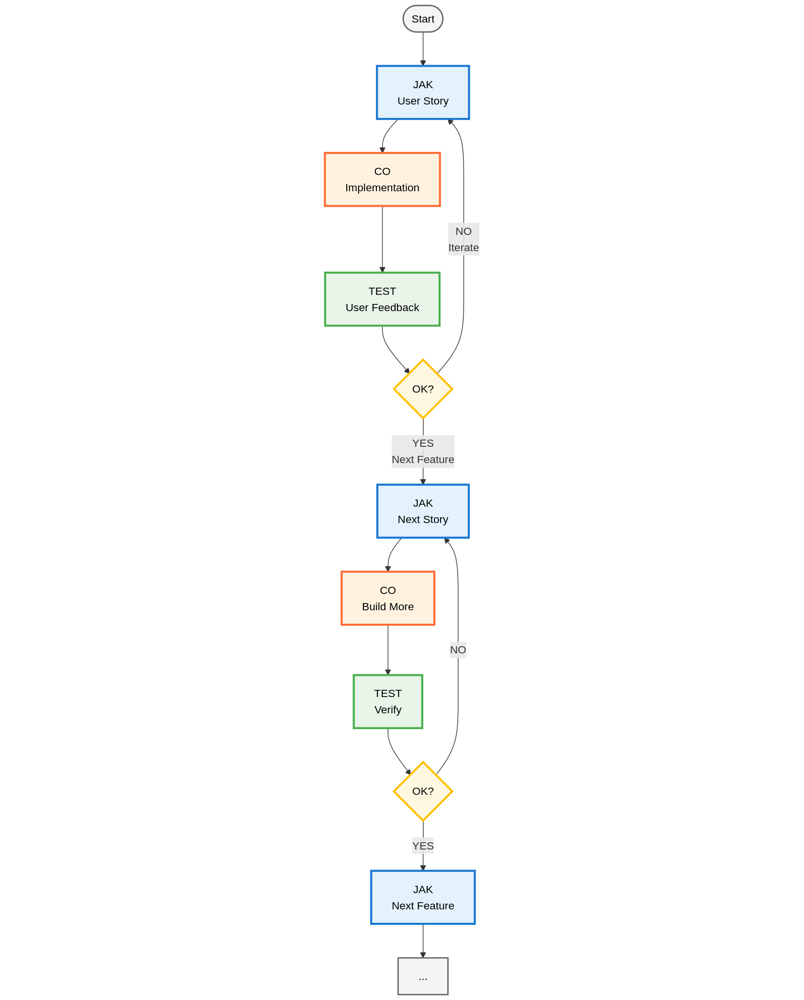
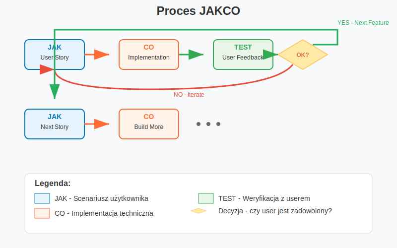

# JAKCO - User-Centered Iterative Development



## User-First Development: Balancing Speed and Architecture

**Value delivered early beats perfect architecture delivered late** - to zasada, która napędza podejście JAKCO (JAK użytkownik → CO aplikacja). 
To metodologia łącząca user-centered design z pragmatycznym podejściem do architektury oprogramowania.


### Co to jest JAKCO?

**JAKCO** to framework dla **User-Centered Iterative Development**, który:
- Rozpoczyna od rzeczywistych potrzeb użytkownika
- Buduje architekturę incrementalnie, ale świadomie
- Łączy szybkość dostarczania z długoterminową maintainability
- Wykorzystuje feedback loops do walidacji zarówno UX jak i rozwiązań technicznych

To **nie jest** chaotyczne kodowanie - to strukturalne podejście do budowania oprogramowania z user experience na pierwszym miejscu.


### Relacja do istniejących metodologii

JAKCO to synteza sprawdzonych praktyk:

| **Metodologia** | **Co wykorzystujemy** |
|-----------------|----------------------|
| **Lean Startup** | Build-Measure-Learn cycle |
| **Agile/Scrum** | Iteracyjność, user stories |
| **BDD** | Behavior-driven scenarios |
| **DDD** | Bounded contexts emerging from user needs |
| **MVP** | Minimum viable feature delivery |
| **Design Thinking** | User empathy, rapid prototyping |


### Proces JAKCO

```
User-Centered Development Cycle
===============================

    ┌─────────────┐    ┌─────────────┐    ┌─────────────┐
    │     JAK     │───▶│   ARCH      │───▶│     CO      │
    │ User Story  │    │ Boundaries  │    │ Implement   │
    │ & Behavior  │    │ & Patterns  │    │ & Test      │
    └─────────────┘    └─────────────┘    └─────────────┘
          ▲                                        │
          │                                NO      ▼
          │                        ┌───────────────┤
          │                        ▼               │
          │                  ┌─────────────┐       │
          │                  │  VALIDATE   │       │
          │                  │ User + Tech │       │
          │                  │  Review     │       │
          │                  └─────────────┘       │
          │                        │               │
          │                        ▼               │
          │                   ┌─────────┐          │
          │                   │ READY?  │          │ YES
          │                   │    ◊    │          │
          │                   └─────────┘          │
          │                        │               │
          │                        │               │
          │                        │               │ 
          │                        │               │
          │                        │               │
          │                 ┌─────────────┐        │  
          │                 │   REFINE    │        │
          │                 │ Story/Arch  │        │
          │                 └─────────────┘        │
          │                        │               │
          │                        ▼               │
          │                ┌─────────────┐         │
          └─────────────── │ NEXT STORY  │◄────────┘
                           │ + Evolution │
                           └─────────────┘

Kluczowe elementy:
==================
JAK    - User story z konkretnym scenariuszem
ARCH   - Architectural boundaries i design decisions
CO     - Implementacja z testami (unit + integration)
VALIDATE - Dual validation: UX + technical quality
EVOLVE - Conscious architecture evolution
```


### Kluczowe zasady grafu:

Cykliczność - proces się powtarza dla każdej funkcji
Iteracyjność - możliwość powrotu i poprawy
User-centric - każdy cykl zaczyna się od potrzeb użytkownika
Feedback loop - szybka weryfikacja z userem
Incrementalność - budowanie krok po kroku

### Różnica vs tradycyjny waterfall:

Waterfall: Analiza → Design → Kod → Test → Deploy
JAKCO: (JAK → CO → Test → Feedback) × N iteracji


## Porównanie podejść


| **JAKCO** | **Standard** |
|-----------|--------------|
| Start od user experience | Start od perfect architecture |
| Buduj incrementalnie | Planuj wszystko z góry |
| User testuje od razu | User czeka na "gotowy" produkt |
| Feedback natychmiastowy | Feedback po miesiacach |

## Przykłady w praktyce

### 🏛️ Standardowe podejście (#CO)

**Prompt standardowy:**
```
Stwórz system zarządzania użytkownikami z następującymi wymaganiami:

- RESTful API z endpointami CRUD
- Baza danych z tabelami users, roles, permissions
- Walidacja danych wejściowych
- System autentykacji JWT
- Middleware do autoryzacji
- Logging i error handling
- Unit testy z 80% coverage
- Dokumentacja API w Swagger
- Separacja warstw: controller, service, repository
- Design patterns: Factory, Strategy, Observer
```

### 📄 [Pełna odpowiedź ChatGPT dla metody CO →](CO.md)


**Rezultat struktury projektu:**
```
src/
├── controllers/
├── services/
├── repositories/
├── middlewares/
├── models/
├── utils/
├── strategies/
├── observers/
├── factories/
├── routes/
├── config/
├── docs/
├── tests/
├── app.js
├── server.js
└── swagger.js
```

**Kiedy user może testować:** Po ukończeniu całego systemu  
**Feedback:** Spóźniony, często prowadzi do dużych zmian  

---


### 🚀 Podejście JAKCO (#JAK)

**Prompt vibecoder style:**
```
JAK: Admin chce dodać nowego pracownika do systemu

Scenariusz:
1. Admin klika "Dodaj pracownika" 
2. Wypełnia formularz: imię, email, dział
3. Klika "Zapisz" 
4. Widzi komunikat "Pracownik dodany" i wraca do listy
5. Nowy pracownik pojawia się na liście z możliwością edycji

CO teraz potrzebuję:
- Formularz z walidacją
- Endpoint POST /users  
- Zapis do bazy
- Lista użytkowników z refresh

Zrób to najprostszym sposobem. Potem dodamy więcej.
```

### 📄 [Pełna odpowiedź ChatGPT dla metody JAK →](JAK.md)


**Rezultat struktury folderów:**
```
project/
│
├── backend/
│   ├── server.js
│   └── db.sqlite (utworzy się automatycznie)
│
└── frontend/
    └── (tu będzie React)
```


**Kiedy user może testować:** Od razu po pierwszej funkcji  
**Feedback:** Natychmiastowy, pozwala na szybkie iteracje  

## Kluczowe różnice w rezultatach


### Metoda #CO (standardowa)
- **15+ plików** już na starcie
- **Kompletna architektura** przed pierwszą linią kodu
- **Wszystkie wzorce projektowe** zaimplementowane z góry
- **User czeka** aż wszystko będzie "gotowe"
- **Wysokie ryzyko** że user będzie niezadowolony po ukończeniu

### Metoda #JAK (JAKCO)
- **2-3 pliki** na początek
- **Minimalna implementacja** dla konkretnego use case
- **Wzorce dodawane** gdy są rzeczywiście potrzebne
- **User testuje** każdą funkcję osobno
- **Niskie ryzyko** - szybka korekta na podstawie feedbacku

## Dlaczego seniorzy nie lubią JAKCO?


**Typowe zarzuty:**
- "Gdzie UML? Gdzie architektura? Gdzie dokumentacja?!"
- "To nie jest maintainable!"
- "Jak dodasz 100 funkcji to się wszystko rozpadnie!"
- "To nie jest professional approach!"

**Odpowiedź vibecoder'a:**
- "User jest zadowolony po 2 godzinach, a nie po 2 tygodniach"
- "Refaktoryzuję jak będzie potrzeba"
- "YAGNI - You Aren't Gonna Need It"
- "MVP > Perfect Architecture"

## Kiedy używać JAKCO?

### ✅ Idealne dla:
- **Startup'ów i MVP** - szybka walidacja pomysłu
- **Małych i średnich projektów** - do 10-20 funkcji
- **Prototypowania** - sprawdzenie feasibility
- **Zespołów z ograniczonym czasem** - deadline pressure
- **Projektów z niejasnymiwymaganiami** - discovery przez iterację

### ❌ Unikaj w przypadku:
- **Systemów mission-critical** - bankowość, medycyna
- **Bardzo dużych enterprise'owych aplikacji**
- **Projektów z rygorystycznymi wymaganiami compliance**
- **Systemów wymagających skalowalności od dnia zero**

## Proces JAKCO krok po kroku


### 1. Zacznij od JAK
```
JAK użytkownik wykona akcję X?
1. Kliknie przycisk Y
2. Zobaczy formularz Z
3. Wypełni pola A, B, C
4. Otrzyma potwierdzenie
```

### 2. Przejdź do CO
```
CO aplikacja musi zrobić?
- Pobrać dane z formularza
- Zwalidować
- Zapisać do bazy
- Pokazać komunikat
```

### 3. Implementuj minimum
- Jedna funkcja
- Najprostszy kod który działa
- Podstawowe testy

### 4. Test z userem
- Pokaż działającą funkcję
- Zbierz feedback
- Zanotuj potrzebne zmiany

### 5. Iteruj
- Popraw na podstawie feedbacku
- Dodaj kolejną funkcję (JAK → CO)
- Refaktoryzuj gdy kod staje się nieczysty

## Podsumowanie

**JAKCO to nie jest silver bullet** - to narzędzie, które sprawdza się w określonych kontekstach. Główne zalety to:

- **Szybsze dostarczanie wartości** użytkownikowi
- **Niższe ryzyko** budowania niewłaściwej funkcji
- **Lepsze zrozumienie** rzeczywistych potrzeb użytkownika
- **Większa motywacja** zespołu (szybkie wins)

Oba podejścia - standardowe i JAKCO - mają swoje miejsce w development'cie. Kluczem jest umiejętność wyboru właściwej metody dla właściwego kontekstu.

Better done than perfect 🎯

---

*P.S. Dla senior devs: JAKCO nie oznacza rezygnacji z dobrych praktyk. To oznacza inteligentne ich stosowanie w odpowiednim momencie. Architecture emerges, nie zawsze musi być planned from day one! 😉*


### Kluczowe zasady

#### 1. **Architectural Consciousness**
```
Każda iteracja obejmuje:
✓ User story analysis
✓ Architecture impact assessment  
✓ Technical debt evaluation
✓ Security & performance implications
✓ Scalability checkpoints
```

#### 2. **Quality Gates**
```
Definicja "Done" dla każdej iteracji:
✓ User acceptance criteria met
✓ Automated tests (unit, integration, e2e)
✓ Code review passed
✓ Security scan completed
✓ Performance baseline maintained
✓ Documentation updated
```

#### 3. **Progressive Architecture**
Zamiast Big Design Up Front, używamy **Architecture Decision Records (ADRs)**:
- Dokumentujemy każdą istotną decyzję architektoniczną
- Uzasadniamy wybory kontekstem biznesowym
- Planujemy evolution path dla kluczowych komponentów

## Porównanie podejść

| **JAKCO** | **Big Design Up Front** | **Chaotic Coding** |
|-----------|--------------------------|-------------------|
| User stories → Architecture boundaries → Implementation | Architecture → Implementation → User testing | Implementation → Hope it works |
| Conscious technical debt | Over-engineering | Unconscious technical debt |
| Progressive architecture | Static architecture | No architecture |
| Continuous validation | Late validation | No validation |
| Quality gates per iteration | Quality gates at end | No quality gates |

## Praktyczny przykład: System zarządzania pracownikami


## Kiedy używać JAKCO?

### ✅ Idealne dla:
- **Nowych produktów** z niejasnym product-market fit
- **Startup'ów** potrzebujących szybkiej walidacji
- **Legacy modernization** - postupowa migracja
- **Innovation labs** - eksploracja nowych możliwości
- **Zespołów z ograniczonym czasem** na research

### ⚠️ Używaj ostrożnie gdy:
- **Regulatory requirements** są sztywne i znane z góry
- **Mission-critical systems** wymagają highest reliability
- **Duże, established zespoły** z mature processes
- **Technical constraints** są dobrze zdefiniowane

### ❌ Unikaj gdy:
- **Safety-critical systems** (aviation, medical devices)
- **Systemy z extreme performance requirements**
- **Projekty z fixed-price contracts** i sztywnymi requirements
- **Zespoły bez senior technical leadership**

## Best Practices

### 1. **Technical Debt Management**
```
Debt Quadrants Analysis (Martin Fowler):
- Reckless/Deliberate: Avoid at all costs
- Reckless/Inadvertent: Address immediately  
- Prudent/Deliberate: Track and plan payback
- Prudent/Inadvertent: Learn and prevent

JAKCO Rule: Maximum 20% of each sprint for tech debt payback
```

### 2. **Architecture Review Cadence**
```
Weekly: Code review + local architecture decisions
Monthly: Component interaction review
Quarterly: System-wide architecture assessment  
Annually: Technology stack evaluation
```

### 3. **Quality Metrics**
```
Code Quality Gates:
- Test coverage > 80% (unit + integration)
- Cyclomatic complexity < 10
- Dependency freshness < 6 months
- Security scan: 0 high/critical issues
- Performance regression: < 5% slowdown
```

## Tooling & Infrastructure

### Development Stack
```yaml
Code Quality:
  - SonarQube: Static analysis
  - ESLint/Prettier: Code formatting
  - Husky: Git hooks
  - Jest: Testing framework

CI/CD Pipeline:
  - GitHub Actions: Automation
  - Docker: Containerization
  - Terraform: Infrastructure as Code
  - ArgoCD: GitOps deployment

Monitoring & Observability:
  - Prometheus: Metrics collection
  - Grafana: Visualization
  - Jaeger: Distributed tracing
  - ELK Stack: Logging
```

### Architecture Documentation
```
Living Documentation:
- ADRs in git repository
- OpenAPI specifications
- Architecture diagrams (C4 model)
- Runbooks for operations
- Decision trees for common scenarios
```

## Podsumowanie

**JAKCO** - to metodologia łącząca user-centric approach z architektoniczną świadomością. Kluczowe zasady:


- 


